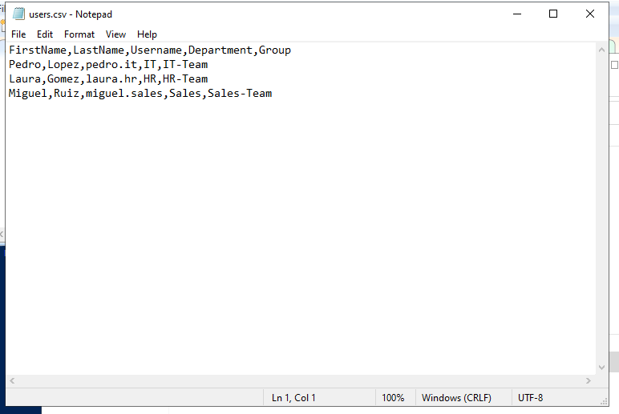
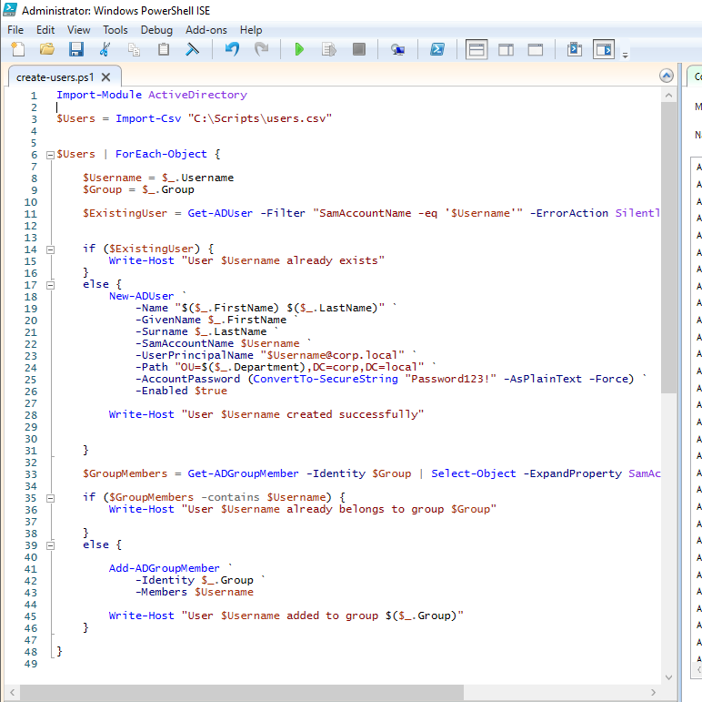
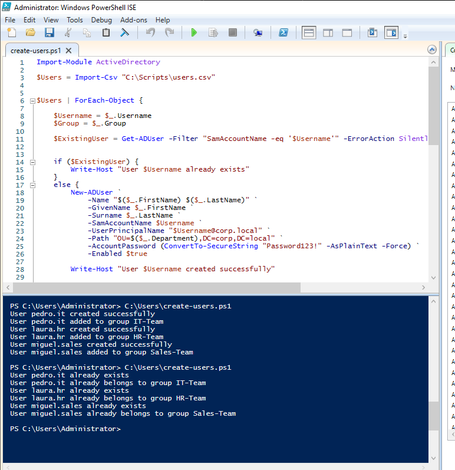
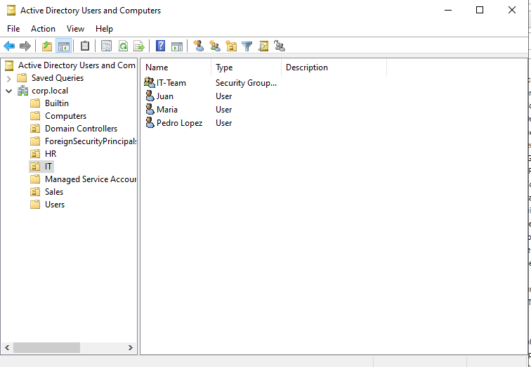
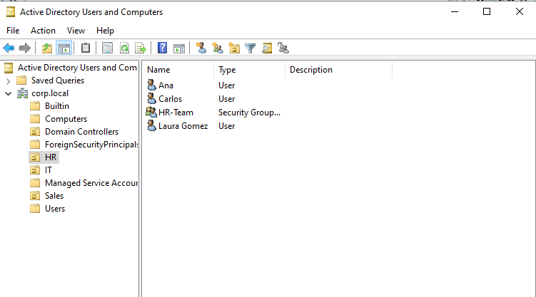
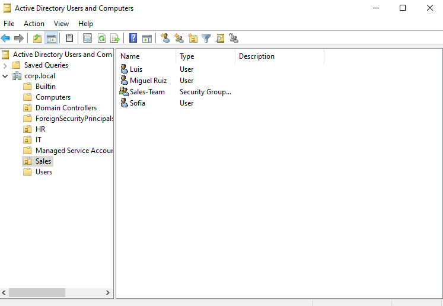
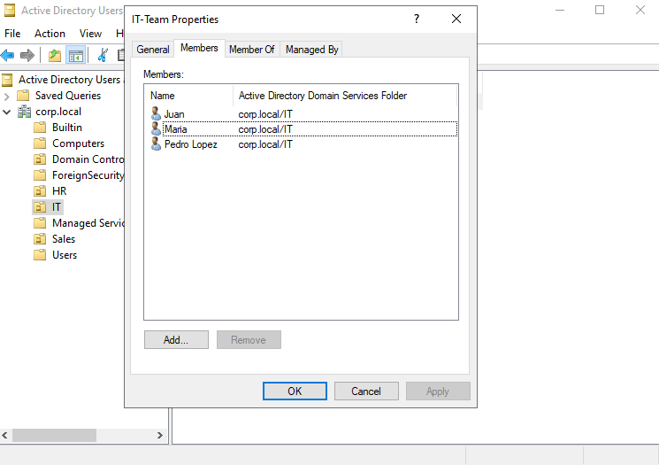

# PowerShell AD Automation Lab

## Overview

This project simulates a real-world IT administration scenario where repetitive Active Directory user provisioning tasks are automated using PowerShell.

Instead of manually creating users, assigning them to Organizational Units, and adding them to security groups, this solution automates the process using CSV-based input.

---

## Business Problem

Manual Active Directory user provisioning is repetitive, time-consuming, and prone to human error.

Common issues include:

- Creating users in the wrong Organizational Unit
- Forgetting to assign group memberships
- Duplicate account creation
- Inconsistent onboarding processes

This lab solves those issues through automation.

---

## Technologies Used

- Windows Server 2022
- Active Directory Domain Services (AD DS)
- PowerShell
- VMware
- CSV-based automation
- Organizational Units (OUs)
- Security Groups

---

## Project Workflow

CSV Input  
↓  
PowerShell Script  
↓  
Active Directory User Creation  
↓  
OU Assignment  
↓  
Security Group Assignment  
↓  
Duplicate Validation  

---

## Script Features

This automation performs:

- Reads user data from CSV input
- Creates Active Directory users automatically
- Assigns users to the correct Organizational Unit
- Adds users to security groups
- Prevents duplicate user creation
- Detects existing group membership
- Provides execution feedback through console output

---

## CSV Input Example

### CSV File

---

## PowerShell Automation Script

### Script

---

## Execution Output

### Console Results

---

## Users Created in Active Directory

### IT Organizational Unit

### HR Organizational Unit

### Sales Organizational Unit

---

## Security Group Validation

### Group Membership

---

## Key Skills Demonstrated

- Active Directory Administration
- PowerShell Automation
- Identity Management
- CSV Data Processing
- Security Group Administration
- Organizational Unit Management
- Scripting Logic
- Duplicate Validation
- IT Process Automation

---

## Outcome

Successfully automated Active Directory user provisioning and group assignment using PowerShell, reducing manual administrative work and improving consistency in account onboarding.
